# Hi Juha_refo

Usages
```shell
git clone git@github.com:contemplation-person/juha_refo.git --recursive-submodul
```
## summary

This repository is the outcome of my project-based learning (PBL) at 42 Seoul.  
All assignments were written for the Intel Mac environment.

## contents

|index|Project name|Simple explanation|Skill|Collaboration|
|:---:|:---:|---|:---:|:---:|
|[1](#pong-nyan)|[pong-nyan](https://github.com/pong-nyan/pong-nyan/tree/33c0c451e01b6fa4921665fc78dd165a5ff368ee "pong-nyan")|make [ping-pong game](https://docs.pong-nyan.site/) website|Typescript, next, nest, docker, postgresql, metter.js|5 people|
|[2](#irc)|[IRC](https://github.com/5Circle42IRC/IRC/tree/4136d45d78612c07b6d22208b89892a9fe776f35 "IRC")|make [irc](https://datatracker.ietf.org/doc/html/rfc1459) chatting program|cpp|3 people|
|[3](#inception)|[inception](https://github.com/contemplation-person/juha_refo/tree/main/succes_mission/inception "inception")|written Dockerfiles for WordPress, Nginx, and MariaDB, and bundled them together using Docker Compose, then deployed them to Docker.|docker|single project|
|4|[CPP](https://github.com/contemplation-person/juha_refo/tree/main/succes_mission/CPP "CPP")|I have acquired fundamental [C++](https://en.cppreference.com/w/) skills.|cpp|single project|
|5|[philo](https://github.com/contemplation-person/juha_refo/tree/main/succes_mission/philo "philo")|I implemented the well-known Dining Philosophers problem and experimented with multi-threading.|C|single project|
|6|[minishell](https://github.com/contemplation-person/minishell/tree/66994c69098979f35fe7778f190e06af55e2f7a3 "minishell")|make small shell|C|2 people|
|[7](#so_long)|[so_long](https://github.com/contemplation-person/juha_refo/tree/main/succes_mission/so_long "so_long")|Implementing a Small 2D Game using MLX|C|single project
|[8](#pipex)|[pipex](https://github.com/contemplation-person/juha_refo/tree/main/succes_mission/pipex "pipex")|Implementing Pipe Communication.|C|single project|
|[9](#printf)|[printf](https://github.com/contemplation-person/juha_refo/tree/main/succes_mission/printf "printf")|Implementing c function printf, using the Variadic Arguments|C|single project|
|[10](#libft)|[libft](https://github.com/contemplation-person/juha_refo/tree/main/succes_mission/libft "libft")|Creating My Own Library|C|single project|

---
## Detail
### pong-nyan
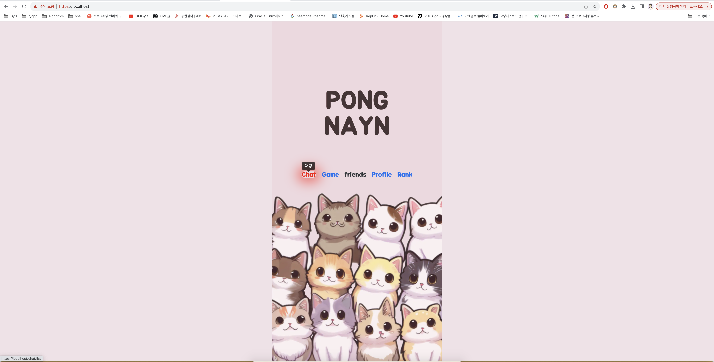
---
* In this assignment, the login function was implemented using Oauth.
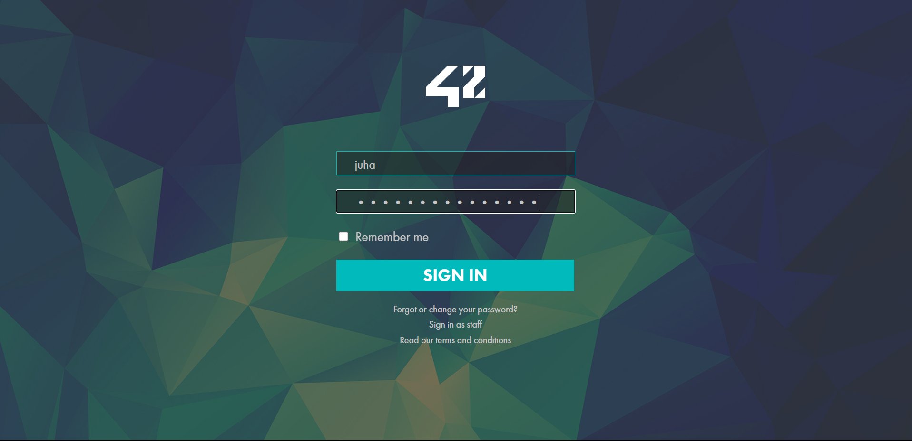
---
* If users wish, they can set up 2FA using Google Authenticator.

---
* We have implemented an advanced game that combines the basic ping pong game and pinball.
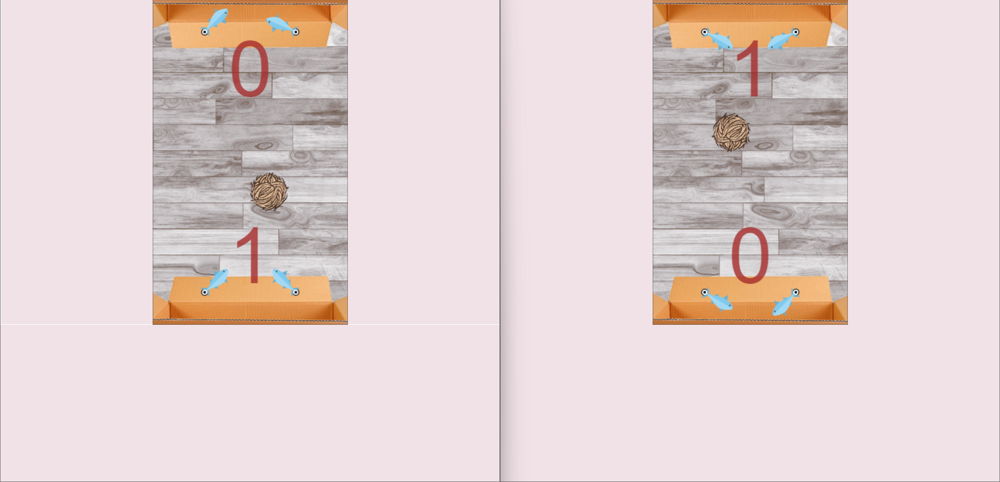
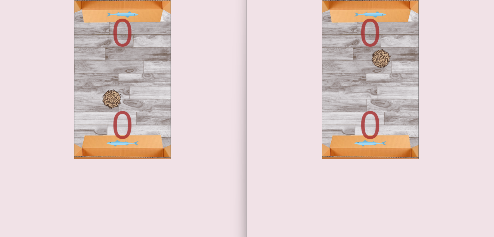
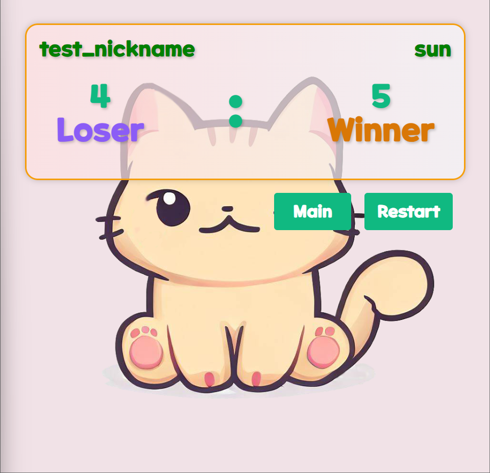
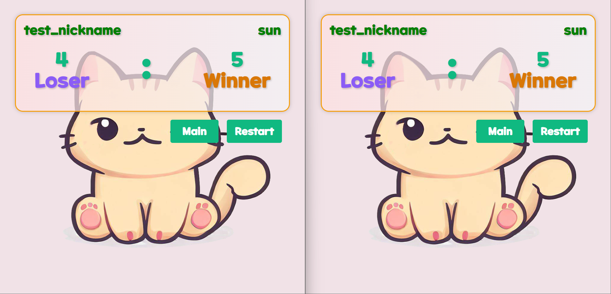
---
* Chat channels and chat rooms have also been implemented, and user profiles can also be changed.
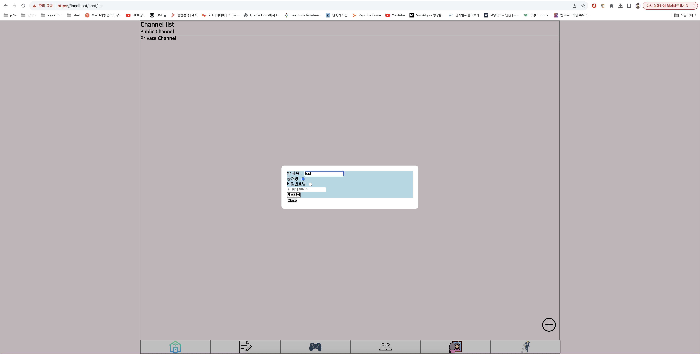

---
* We also implemented a score page that shows each user's recorded score.
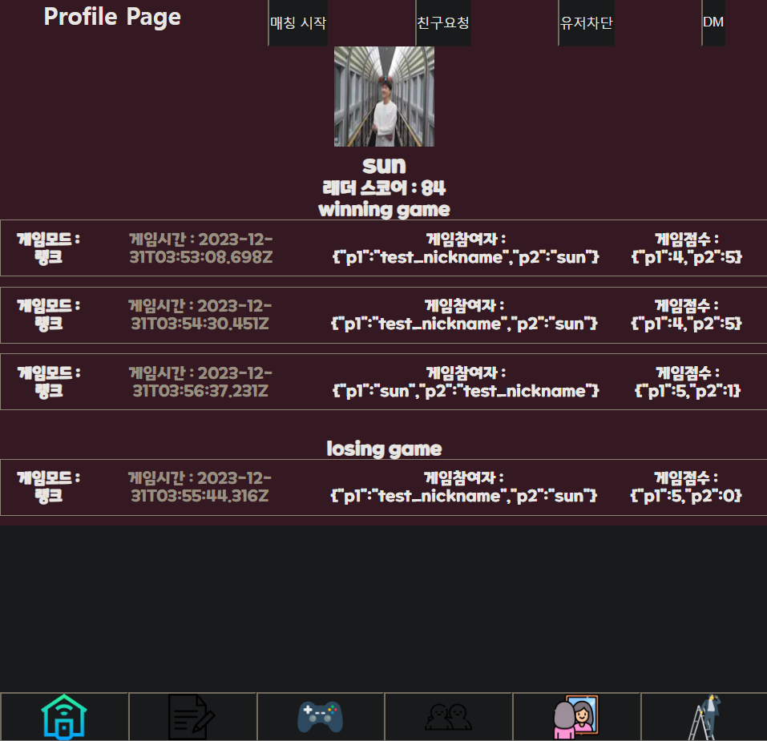
---
* We used nginx to connect the socket, front, and backend.
* User match records are stored in postgresql.
* A docker compose file was created to allow development regardless of the development environment, nest was used for the backend, and react and next were used for the frontend.
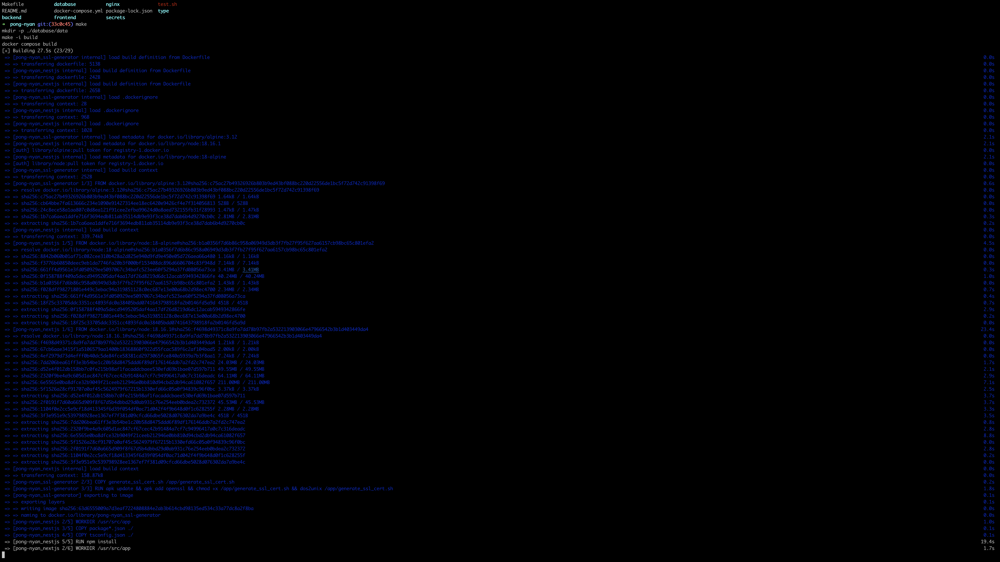
---
* Rather than using a separate library to maintain the state, we implemented it individually using drilling technology.

[top](#contents)

### IRC
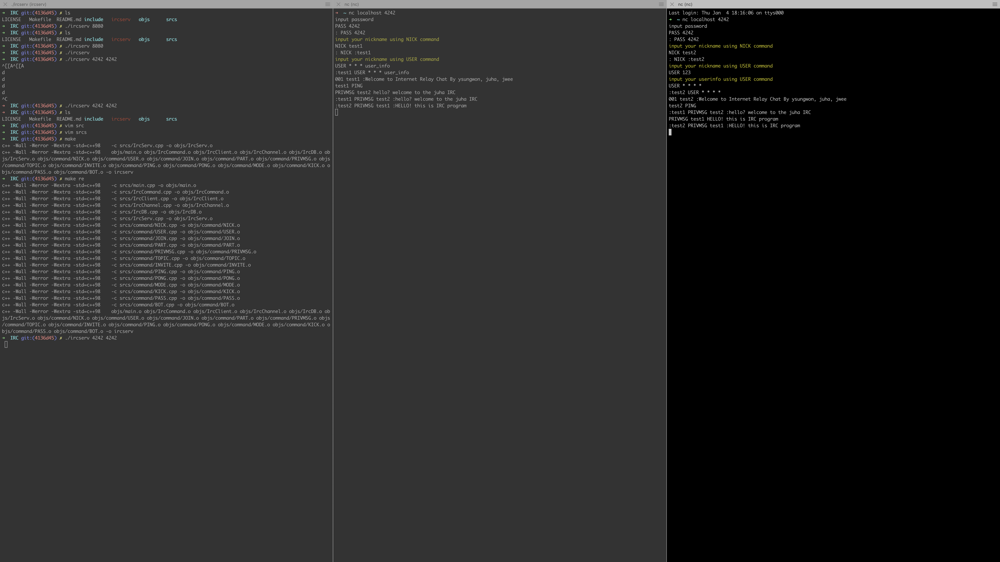
* We created a chat server using the basic Internet Relay Chat Protocol.
* I created a server using multiplexing technology using the select function.
* I was in charge of server implementation and implemented the channel topic and mode.

[top](#contents)

### INCEPTION

### so_long
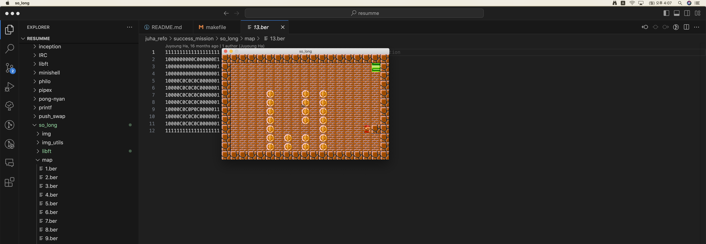
* It's a simple 2D program where you pass through the exit after collecting all the coins.

Usage    
```bash
cd juha_refo/success_mission/so_long
make; ./so_long ./map/13.ber
```
Movement keys: 
    Up   : w 
    Down : s 
    Left : a 
    Right: d

game clear condition
* Collect all the coins and exit pipe

[top](#contents)

### Pipex
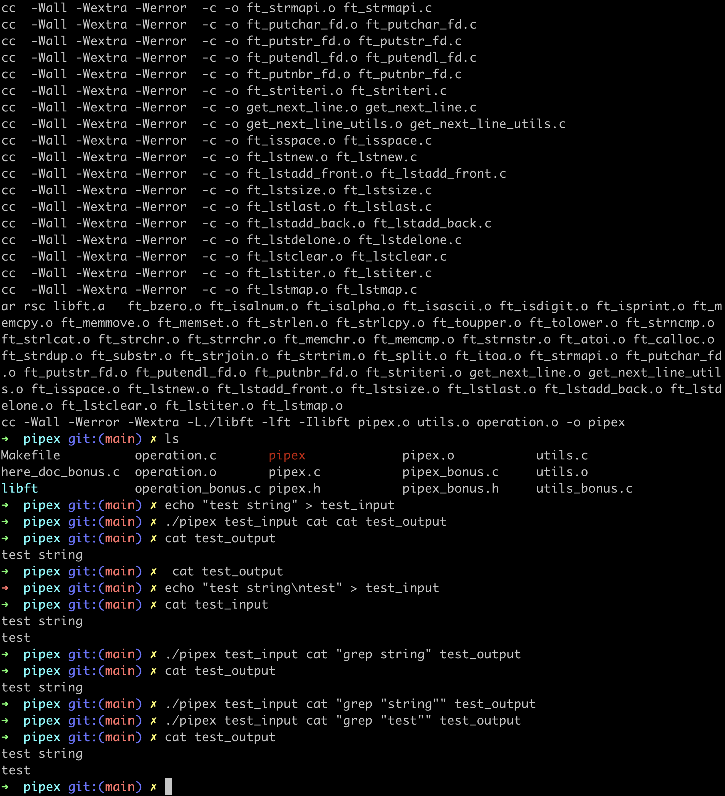
* The task is to implement pipes, a shell command-line option. 

Usage
```bash
cd juha_refo/success_mission/printf
make; ./pipex [input_filename] [cmd] [cmd] [output_filename]
```
[top](#contents)

### Printf
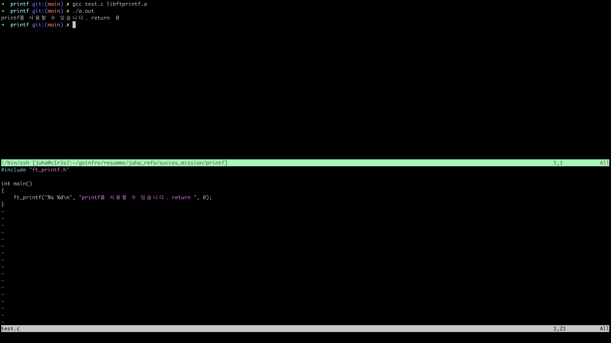
* %c, %s, %p, %d, %i, %u, %x, %X, %% of actual printf were implemented using variable arguments.

Usage
```bash
cd juha_refo/success_mission/printf
make
```
[top](#contents)

### Libft
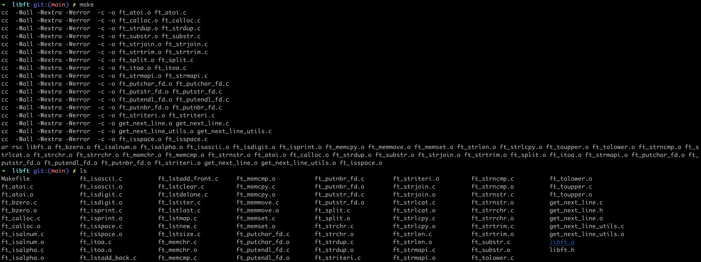
* The libft task is to create my own static C library.
* Some functions were created identically to the standard C library, and functions such as list functions and get_next_line were created as needed.

Usage
```bash
cd juha_refo/success_mission/libft
make
```
[top](#contents)